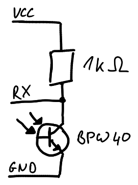
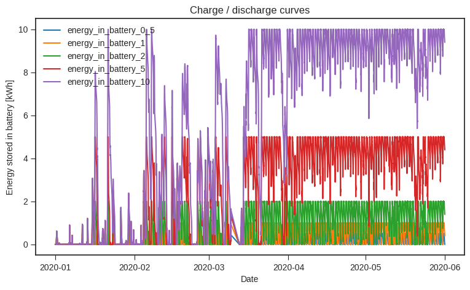

# Battery Simulation for PV Systems 
 
This software simulates batteries for your PV system and calculates how much you could increase your own consumption. All calculations are done using your individual power consumption profile, as well as the specific power generation profile of your PV system.

All calculations are done in [Simulate_Battery.ipynb](Simulate_Battery.ipynb)

## Introduction

On sunny days your PV system usually gives the excess energy that you cannot use at home to the grid, while you have to draw energy from the grid on cloudy days (and at night). Your own consumption can be increased by adding a battery to your PV system. The size of the battery (and inverter) heavily depends on the setup of your PV system and especially on your personal power consumption profile.

Modern energy meters provide all the information needed to simulate different batteries and inverters for your personal needs. This software uses this data to find out which combination best fits your needs and assists you in your buying decision.

E.g. the plot below shows how much of the energy that you are currently dawing from the gird could be provided by a battery.

Besides other more detailed analyses you can for example see how much energy each battery could provide during differnent months of the year.

As the plots are created based on your personal power data, the decisions you make based on them can be very accurate.

## Recording Data

### Hardware Setup

Digital energy meters often contain an IR interface that continuously sends the current power consumption.

The provided power value is positive if you draw energy from the grid and negative if the excess of your PV system is fed into the grid.

To record this data for later analysis, a IR reader is needed. A simple version for a smart meter IR reader can be found here: 
https://wiki.volkszaehler.org/howto/simpler_ir_leser

A photodiode in combination with a 1k Ohm resistor is enough to build IR read head.

Besides the described TEKT5000S-ASZ you can also use a BPW40 phototransistor and connect it in the following way to your serial interface:

After accurately placing it in front of the IR diode of the energy meter, the data can be read from the serial interface. The camera of your cell phone might help you finding the IR diode of your energy meter. In the live view of the camera you can see it flashing, when data is send.

### Software Setup

Different software can be used to read the data from the serial interface. If you are already running an home automation system like [openhab](https://www.openhab.org/), you can add the smart meter to your configuration and use openhab to record the power data of your home.

If you are not using a home automation system yet, you can run a simple python script to record the data.

In both cases the data has to be recorded for a "representative" time frame to allow meaningful a analysis. As the power data contains both, information about the power you are drawing and the power your PV system is feeding to the grid, a period of several month is reasonable to cover also seasonal effects. Of cause, you can already run the analysis after a much shorter time to see first results!

#### Openhab

The data can be read and stored e.g. using a home automation software like [openhab](https://www.openhab.org/)  by intalling the appropriate binding ([openhab SmartMeter Binding](https://www.openhab.org/addons/bindings/smartmeter/) ) and persinsting the data for later analysis. The configuration also allows to specify how many values should be stored (e.g. ever 5 seconds).

Once enough data is persisted in openhab it can be exported from the influxdb database. The following shell command stores all measurements of the item `Strom_Leistung_Gesamt` (containing your power data) into a text file. The time frame of the export has to be adjusted according the the time period of the recoding. However, too long time periods (> 3 month) might lead to errors during the export.
 
	curl -G http://localhost:8086/query?db=openhab_db -u grafana:PASSWORD --data-urlencode "q=SELECT * FROM Strom_Leistung_Gesamt WHERE time > '2020-04-01T00:00:00Z' AND time < '2020-06-01T00:00:00Z'" > resultAprilMai.json

#### Copy Data from Openhab Server

Run the following command on the PC where you will do the analysis of the data. After providing the password for the `openhab` user, it exports the above created json file and stores it in the current directory. (Notice the "." at the end of the command).

	scp openhabian@OPENHAB_IP:/home/openhabian/resultAprilMai.json .

#### Record Data with Python Script

*Todo: Provide python script to record data and store it in a txt file.*

## Analyzing Data

The analysis of the previously recorded data is done in a jupyter notebook. Herein, several "virtual" batteries can be simulated. This is done by going though all the records of your smart meter. If you are feeding power to the gird, your virtual batteries are charged. If you are later drawing energy from the grid, your batteries are discharged. The maximum (dis)charge power can be adjusted to simulate different inverter sizes. After aggregating this information you can see how much of the energy that your currently drawing from the grid could be covered by a battery. Simulation of different battery sizes helps you finding the best setup for your personal power consumption profile in combination with your already installed PV system.

To run the analysis, download the jupyter notebook file ([Simulate Battery.ipynb](./Simulate_Battery.ipynb)) and run it on your local PC. You have to modify the first part of the notebook to load the data you exported from your energy meter.

In the notebook the following analyses are done:

This summary shows how much of the enerty that you are currently dawing from the grid could be provided by batteries of different sizes. It also shows how energy you still have to draw from the grid when using these batteries.

More details are given in the monthly overview. Herein, the energy is shwon that a battery could provide during each month of the year. This helps to estimate seasonal effects.

A closer look at the state of charge of the virtual batteries is possible with the following plot. It shows that smaller batteries are more frequently fully discharged (especially during summer) than larger batteries.

The last plot shows how the energy was drawn from the batteries over time. A steeper curve indecates that more energy could be drawn from the battery.

